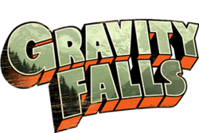

# 🌟 My Favorite Show: *Gravity Falls*

## 🌀 Overview
**Gravity Falls** is a mystery-comedy animated series created by *Alex Hirsch*.  
It follows twins **Dipper** and **Mabel Pines** who spend their summer vacation uncovering the secrets of a strange town called *Gravity Falls, Oregon*.

---

## 🧩 Main Characters
- 🧢 **Dipper Pines** — Curious, intelligent, and always searching for the truth.  
- 🌈 **Mabel Pines** — Energetic, optimistic, and loves her sweaters!  
- 🧙 **Grunkle Stan** — Their great-uncle who runs the Mystery Shack.  
- 🐷 **Waddles** — Mabel’s adorable pet pig.

---

## 💫 Why I Love This Show
> “Reality is an illusion, the universe is a hologram, buy gold, bye!” – *Bill Cipher*

I love *Gravity Falls* because of its:
- Clever humor and mystery-filled story  
- Hidden codes and secret messages  
- Emotional moments mixed with fun adventures  

---

## 🔍 Fun Facts
- The entire series was **planned with a clear beginning and ending**, which made the story feel complete.  
- The show hides **ciphers and hidden clues** in almost every episode!  
- The mysterious author of the journals was one of the biggest twists in cartoon history.

---

### 🎬 Favorite Episode
**“Not What He Seems”** — The big reveal about Grunkle Stan still gives me chills!

---

### 📺 Final Thoughts
If you love mystery, humor, and emotional storytelling, **Gravity Falls** is a must-watch!
